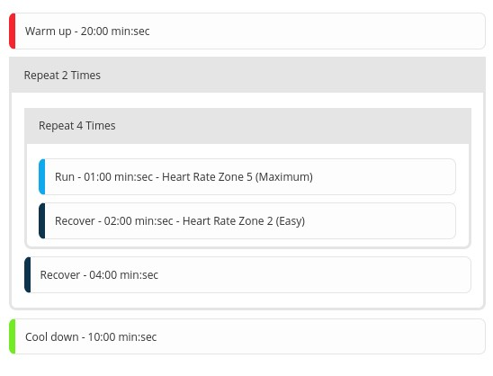

# Garmin Plan

[](https://github.com/Raistlfiren/garmin-csv-plan/actions)

This is a PHP implementation of the great program that mgifos created [here](https://github.com/mgifos/quick-plan). 
The intentions of the program is to parse a CSV file and create workouts in Garmin Connect.
It also has the ability to:
 - Import workouts from a file into Garmin Connect
 - Prefix workouts with some text ex.: Convert `14k, 4x 1.6k @TMP` TO `HANSON:14k, 4x 1.6k @TMP`
 - Add notes to workout steps
 - Delete workouts that are made based upon the CSV file
 - **ONLY** delete workouts (Do not import anything)  
 - Schedule workouts on Garmin Connect calendar based upon a start **OR** end date

## Examples
Convert this text -

```csv
running: 2x4x2'@z5
- warmup: 20:00
- repeat: 2
   - repeat: 4
      - run: 1:00 @z5
      - recover: 2:00 @z2
   - recover: 4:00
- cooldown: 10:00
```

INTO 



AND SCHEDULED ONTO


Through this command - 

```shell
docker-compose exec garmin-dev bin/console garmin:workout tests/Resource/all-example.csv schedule -s '2021-05-01' -r 'TriPrep: '
```

## Setting up the application to develop or run
1) Download and install [PHP](https://www.php.net/) and [composer](https://getcomposer.org/)
2) Run `composer install`
3) Put your username and password in `.env` file
4) Run the application by `./bin/console garmin:workout`

## Running the program through Docker
1) Copy the CSV file to the root directory (The file will then be copied to the Docker container)
2) `docker-compose run garmin ./bin/console garmin:workout <file.csv>`

## Usage

Specify a CSV file to create and delete workouts in Garmin connect and schedule them on the Garmin calendar.

## Examples

**You can remove the -m and -p flag by copying `.env` to `.env.local` AND updating the file with your username and password under 
`GARMIN_USERNAME` and `GARMIN_PASSWORD`.**

```shell

# Basic example of importing workouts into Garmin
bin/console garmin:workout <file.csv> -m <garmin_email> -p <garmin_password>

# Import AND Schedule workouts into Garmin on January 1, 2020. End date is assumed based upon plan length.
# End date can be specified with the -d flag. The same can be assumed with the start date.
bin/console garmin:workout <file.csv> schedule -m <garmin_email> -p <garmin_password> -s '2020-01-01'

# Same as above but delete all previous items first, import items and schedule them, and prefix with HANSON: before all workouts
bin/console garmin:workout <file.csv> schedule -m <garmin_email> -p <garmin_password> -s '2020-01-01' -x -r 'HANSON:'

# Only delete the previous workouts (notice capital "x")
bin/console garmin:workout <file.csv> schedule -m <garmin_email> -p <garmin_password> -s '2020-01-01' -X -r 'HANSON:'

# Do a mock run of importing workouts like above
bin/console garmin:workout <file.csv> schedule -m <garmin_email> -p <garmin_password> -s '2020-01-01' --dry-run
```

## Arguments

`<file.csv>` - The specified CSV file that you want to import into Garmin connect.

`import|schedule` - Specify import or schedule to either just import the workouts into Garmin connect 
or import **AND** schedule the workouts.

## Options

`--email`, `-m` - email that you use to login to Garmin

`--password`, `-p` - password that you use to login to Garmin

`--delete`, `-x` - delete previous workouts that are in the plan from Garmin

`--delete-only`, `-X` - ONLY delete previous workouts that are in the plan from Garmin

`--dry-run` - List out workouts found in the plan and display them

`--prefix`, `-r` - Prefix all workouts with text

`--start`, `-s` - Specify the start date of when you want scheduled workouts to be planned on your calendar in Garmin

`--end`, `-d` - Specify the end date of when you want scheduled workouts to be planned on your calendar in Garmin

## Developing and running the program through Docker
1) Start by building and running the docker file - `docker-compose up garmin-dev`
1) Install dependencies - `docker-compose exec garmin-dev composer install`
   
    a) Adding dependencies or removing dependencies can be done through `docker-compose exec garmin-dev composer require <package>`
    
    b) Updating dependencies csn be done through `docker-compose exec garmin-dev composer update`

2) Run the docker install by running `docker-compose up garmin-dev` (This runs the docker container and keeps it up)
3) Execute a command by running `docker-compose exec garmin-dev bin/console garmin:workout ...`

## Running PHPUnit tests

If you want to run PHPUnit tests, then you can easily run it through the dev build.

1) Follow the above to develop and run the program through Docker.
2) Run the following - `docker-compose exec garmin-dev vendor/bin/phpunit`

## Overriding Docker

Create a **new** file in the root called `docker-compose.override.yaml`.

```yaml
version: '3.3'

services:
  garmin-dev:
    environment:
      XDEBUG_CONFIG: "client_host=<local_IP>"
```
### Debugging the application through PhpStorm
1) If running linux, then you will need to modify the `docker-compose.yaml` file and add your IP in place of `host.docker.internal`
2) Go to PhpStorm -> Settings -> Languages & Frameworks -> PHP -> Servers
   
   a) Click "+"
   
   b) Name docker-cli (Same as serverName under PHP_IDE_CONFIG environment variable)
   
   c) Host _
   
   d) Default 80
   
   e) Debugger Xdebug
   
   f) Check the checkbox next to "Use path mappings"
   
   g) Modify the absolute path on the server to /var/www/html
